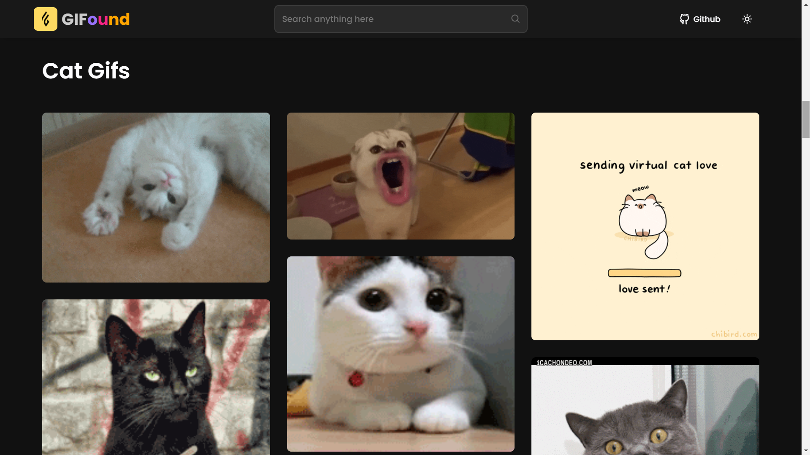
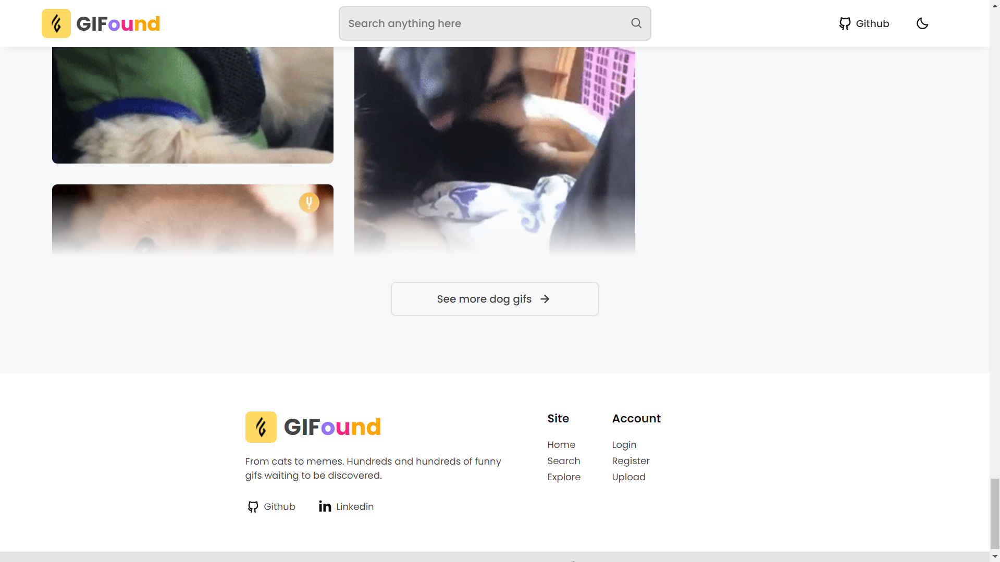

<h1 align="center">
  <div align="center">
    
  </div>
  GIFound
</h1>
<p align="center">
    A place for discover hundreds of funny gifs 
    <br />
    <a href="https://gifound.vercel.app">Go to website</a>&nbsp;
    ·
    &nbsp;<a href="https://github.com/lllariogonzalez/GIFound/issues">Report Bug</a>
  </p>
<br/>

## Project Images

<kbd>
  
</kbd>

<kbd>
  
</kbd>
---
<kbd>
  
</kbd>

<kbd>
  
</kbd>

## Technologies 

This project was built using these technologies:

* [React.js ⚛️](https://es.reactjs.org/)
* [Styled Components 💅](https://styled-components.com/)
* Deployed on [Vercel 🔺](https://vercel.com/)


## Getting Started

If you want to try this project, clone down this repository. You will need `node.js` and `git` installed globally on your machine.

### Installation and Setup Instructions

1. In the project directory, run:

 ```
 npm install
 ```

2. After, you can run:

```
npm run dev
```

This will run the app in the development mode.
Open [http://localhost:3000](http://localhost:3000) to view it in the browser.
