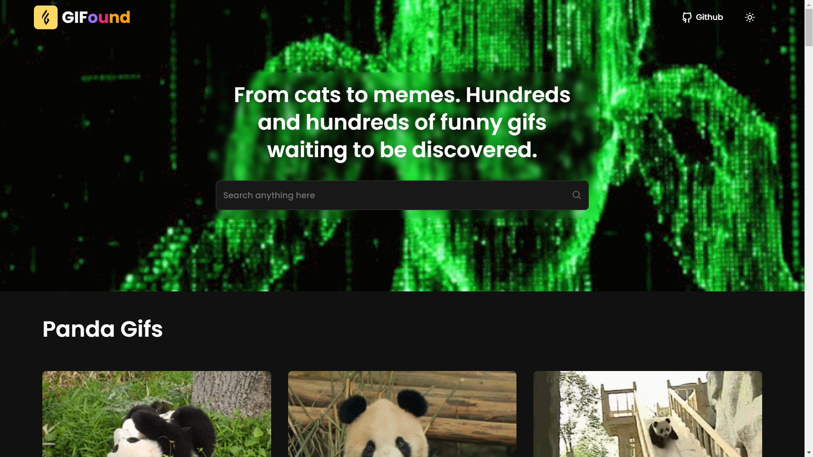

<h1 align="center">
  <div align="center">
    
  </div>
  GIFound
</h1>
<p align="center">
    A place for discover hundreds of funny gifs 
    <br />
    <a href="https://gifound.vercel.app">Go to website</a>&nbsp;
    ·
    &nbsp;<a href="https://github.com/lllariogonzalez/GIFound/issues">Report Bug</a>
  </p>

<br/>

## Description made with AI

Introducing our sleek and user-friendly GIF Explorer app, crafted with React and styled using the power of Style Components. Dive into a world of endless laughter and expressiveness as you navigate through our intuitive interface.

Key Features:

🎉 Dynamic GIF Grid: Immerse yourself in a visually captivating experience with a dynamic grid of GIFs, meticulously organized by themes. From humor to emotions, easily find the perfect GIF to convey your feelings.

🔍 Effortless Search: Unleash the power of our smart search functionality to locate that specific GIF in an instant. Simply enter keywords or phrases, and let the app seamlessly fetch the most relevant results for you.

💻 Built with React: Enjoy a seamless and responsive user interface, thanks to the efficiency of React. Our app is designed to provide a smooth performance across various devices, ensuring an enjoyable GIF exploration experience.

✨ Stylish with Style Components: We believe in aesthetics, and that reflects in our app's design. Styled with the elegance of Style Components, the interface is not just functional but also visually pleasing, making your GIF discovery journey delightful.

Whether you're looking to add a touch of humor to your conversations or express heartfelt emotions, our React and Style Components-powered GIF Explorer is your go-to destination for all things animated. Download now and let the GIF adventure begin! 🌟

## Project Images

<div align='center' style='margin: auto;'>
  
  
  
  
</div>

## Technologies 

This project was built using these technologies:

* [React.js ⚛️](https://es.reactjs.org/)
* [Styled Components 💅](https://styled-components.com/)
* Deployed on [Vercel 🔺](https://vercel.com/)


## Getting Started

If you want to try this project, clone down this repository. You will need `node.js` and `git` installed globally on your machine.

### Installation and Setup Instructions

1. In the project directory, run:

 ```
 npm install
 ```

2. After, you can run:

```
npm run dev
```

This will run the app in the development mode.
Open [http://localhost:3000](http://localhost:3000) to view it in the browser.
